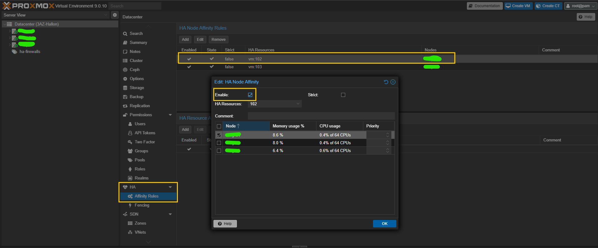

# ProxLB Ansible Deployment

Deploy ProxLB (Proxmox Load Balancer) to an existing server using Ansible.

## Prerequisites

- Ansible 2.10+
- Target server with Ubuntu/Debian
- SSH access to the target server
- Python 3 on the target server

### Install Ansible Collections

```bash
ansible-galaxy collection install community.docker
```

## Quick Start

1. **Create inventory file:**

```bash
cp inventory.example.yml inventory.yml
```

Edit `inventory.yml` with your server details:

```yaml
all:
  hosts:
    proxlb_server:
      ansible_host: "192.168.1.100"
      ansible_user: "ubuntu"
      ansible_ssh_private_key_file: "~/.ssh/id_rsa"
```

2. **Configure variables:**

```bash
cp vars/main.example.yml vars/main.yml
```

Edit `vars/main.yml` with your Proxmox cluster details:

```yaml
proxmox_hosts:
  - "proxmox1.example.com"
  - "proxmox2.example.com"

proxmox_token_id: "proxlb"
proxmox_token_secret: "your-api-token-secret"
```

3. **Run the playbook:**

```bash
ansible-playbook -i inventory.yml deploy.yml
```

## Usage Examples

### Full deployment
```bash
ansible-playbook -i inventory.yml deploy.yml
```

### Update configuration only
```bash
ansible-playbook -i inventory.yml deploy.yml --tags "config"
```

### Force container restart
```bash
ansible-playbook -i inventory.yml deploy.yml -e "proxlb_restart=true"
```

### Force pull latest image
```bash
ansible-playbook -i inventory.yml deploy.yml -e "proxlb_force_pull=true"
```

### Dry run (check mode)
```bash
ansible-playbook -i inventory.yml deploy.yml --check
```

## Configuration Options

All configuration is done in `vars/main.yml`. Key options:

| Variable | Default | Description |
|----------|---------|-------------|
| `proxlb_image` | `gyptazy/proxlb:latest` | Docker image |
| `proxlb_base_dir` | `/opt/proxlb` | Installation directory |
| `proxlb_timezone` | `Europe/Madrid` | Container timezone |
| `balancing_method` | `memory` | Balancing method (memory/cpu/disk) |
| `balancing_mode` | `used` | Resource mode (assigned/used/psi) |
| `balancing_enforce_affinity` | `true` | Enforce pool affinity/anti-affinity rules |
| `balancing_enforce_pinning` | `true` | Enforce plb_pin_* tags for VM pinning |
| `service_schedule_interval` | `12` | Check interval |
| `service_schedule_format` | `hours` | Interval format (hours/minutes) |

See `vars/main.example.yml` for all available options.

## Pool Affinity/Anti-Affinity Rules

ProxLB supports pool-based affinity rules to control VM placement.

### Setup in Proxmox

1. Create a pool: **Datacenter -> Pools -> Create**
2. Add VMs to the pool
3. Configure the pool in `vars/main.yml`

### Pool Types

| Type | Description | Use Case |
|------|-------------|----------|
| `affinity` | Keep VMs together on the same node | App + local cache |
| `anti-affinity` | Spread VMs across different nodes | HA pairs, replicas |

### Pinning VMs to Specific Nodes

Use Proxmox tags to pin VMs to specific nodes:

1. In Proxmox, add tag `plb_pin_<nodename>` to the VM
2. Example: `plb_pin_pve-node01` pins the VM to `pve-node01`

**Important limitations:**
- Pinning tags have priority over `maintenance_nodes` - pinned VMs will NOT be evacuated during maintenance
- For planned maintenance of nodes with pinned VMs, manually remove the pin tag first
- Use Proxmox HA as a fallback for node failures (HA will migrate VMs regardless of ProxLB pinning)

### Recommended Strategy for HA Services

For critical services like HA firewalls:

1. Use `anti-affinity` pool to ensure VMs run on different nodes
2. Use `plb_pin_*` tags to keep VMs on preferred nodes during normal operation
3. Enable Proxmox HA for automatic failover if a node crashes
4. For planned maintenance: remove pin tag -> wait for migration -> maintain -> restore tag

### Example Configuration

```yaml
balancing_pools:
  # HA Firewalls - ensure they run on different nodes
  # Pin using plb_pin_<nodename> tags on VMs in Proxmox
  ha-firewalls:
    type: anti-affinity
    strict: false         # Allow temporary co-location if needed

  # Database replicas - spread across nodes
  ha-databases:
    type: anti-affinity
    strict: true          # Never allow on same node
```

## Maintenance Mode

To evacuate VMs from a node before maintenance:

1. Edit `vars/main.yml`:
```yaml
proxmox_maintenance_nodes: ["pve-node01"]
```

2. Apply the configuration:
```bash
ansible-playbook -i inventory.yml deploy.yml --tags "config"
```

3. ProxLB will migrate VMs off the node

4. After maintenance, remove from the list and re-apply

**Note:** VMs with `plb_pin_*` tags pointing to the maintenance node will NOT be evacuated automatically. You must remove the pin tag first or migrate manually.

## File Structure

```
ansible/proxlb/
├── deploy.yml                  # Main playbook
├── inventory.example.yml       # Example inventory
├── README.md                   # This file
├── templates/
│   ├── docker-compose.yml.j2   # Docker Compose template
│   └── proxlb.yaml.j2          # ProxLB config template
└── vars/
    └── main.example.yml        # Example variables (copy to main.yml)
```

## Post-Deployment

After deployment, ProxLB will be running at `/opt/proxlb`.

### Check container status
```bash
ssh user@server "docker ps | grep proxlb"
```

### View logs
```bash
ssh user@server "docker logs -f proxlb"
```

### Manual restart
```bash
ssh user@server "cd /opt/proxlb && docker compose restart"
```

## Planned Maintenance with HA-Managed VMs

When VMs are managed by both ProxLB and Proxmox HA with node affinity rules, you need to coordinate maintenance to avoid migration loops (ProxLB migrates away, HA migrates back).

### Step-by-Step Maintenance Workflow

**Example scenario:** Maintaining `pve-node-a1` with VM 102 that has HA node affinity to `pve-node-a1`.

#### 1. Disable HA Node Affinity (Proxmox UI)

Navigate to: **Datacenter → HA → Affinity Rules**

Click "Edit" on the HA Node Affinity rule for your VM and **uncheck "Enable"**:



**Key point:** You're disabling the *node affinity rule*, NOT the HA resource itself. The VM stays under HA protection, but without the preferred node restriction during maintenance.

This prevents HA from migrating the VM back to `pve-node-a1` during maintenance.

#### 2. Enable ProxLB Maintenance Mode

Edit `vars/main.yml`:
```yaml
# Add the node to maintenance
proxmox_maintenance_nodes: ["pve-node-a1"]

# Optional: Reduce schedule interval for faster migration
service_schedule_interval: 10
service_schedule_format: "minutes"
```

Deploy the configuration:
```bash
ansible-playbook -i inventory.yml deploy.yml --tags config
```

**ProxLB will migrate VM 102 away from `pve-node-a1` in the next cycle (10 minutes).**

#### 3. Perform Maintenance

Once VM 102 has migrated to another node:
- Update packages
- Reboot `pve-node-a1`
- Perform any necessary work

Verify the node is back online and healthy.

#### 4. Disable Maintenance Mode

Edit `vars/main.yml`:
```yaml
# Remove the node from maintenance
proxmox_maintenance_nodes: []

# Restore normal schedule
service_schedule_interval: 12
service_schedule_format: "hours"
```

Deploy the configuration:
```bash
ansible-playbook -i inventory.yml deploy.yml --tags config
```

#### 5. Re-enable HA Node Affinity (Proxmox UI)

Navigate to: **Datacenter → HA → Affinity Rules**

Click "Edit" on the HA Node Affinity rule and **check "Enable"** again.

**Proxmox HA will automatically migrate VM 102 back to `pve-node-a1` (failback).**

### Quick Reference Commands

```bash
# Enable maintenance (fast migration)
# 1. Edit vars/main.yml: set maintenance_nodes and reduce schedule
ansible-playbook -i inventory.yml deploy.yml --tags config

# Disable maintenance (restore normal operation)
# 2. Edit vars/main.yml: remove maintenance_nodes and restore schedule
ansible-playbook -i inventory.yml deploy.yml --tags config
```

### Alternative: plb_ignore Tag

For VMs that should NEVER be moved by ProxLB (fully managed by Proxmox HA):

1. In Proxmox UI, add tag `plb_ignore` to the VM
2. ProxLB will completely ignore these VMs
3. For maintenance, manually migrate using Proxmox UI before node maintenance

## References

- [ProxLB Documentation](https://github.com/gyptazy/ProxLB)
- [ProxLB Example Config](https://github.com/credativ/ProxLB/blob/main/config/proxlb_example.yaml)
- [Maintenance Mode Guide](MAINTENANCE.md) - Detailed guide for HA integration
